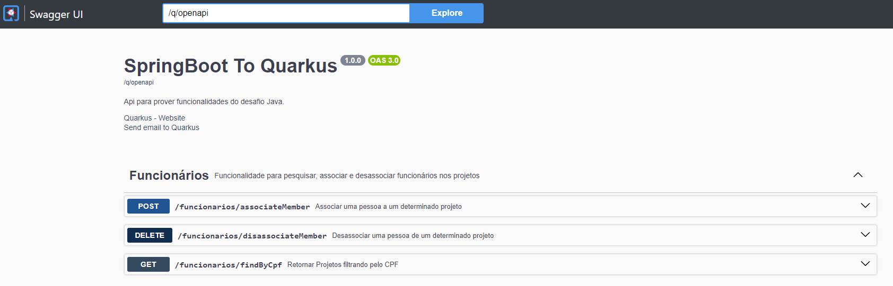
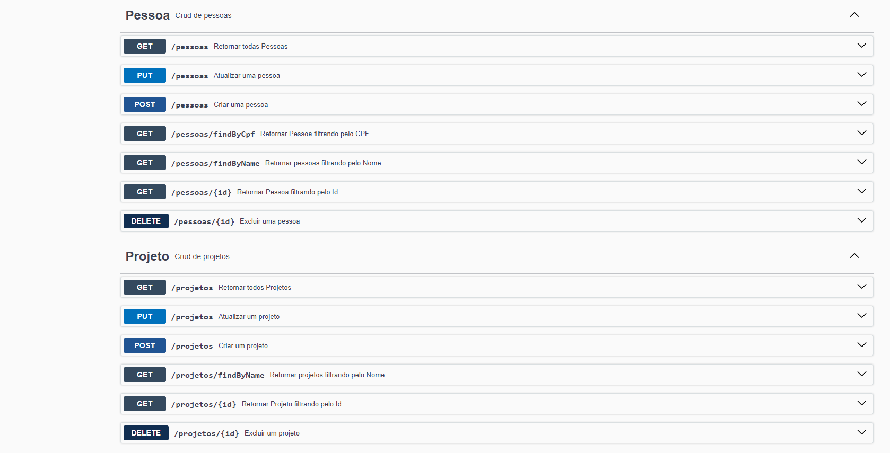

# DesafioJava
API Rest pra possibilitar:

Consultar, Incluir, Alterar, Deletar **Projetos**;

Consultar, Incluir, Alterar, Deletar **Pessoas**;

Consultar, Associar, Desassociar **Funcionários de Projetos**;

Sistema para gerenciar os dados do portfólio de projetos de uma empresa;

Para rodar o projeto é necessário ter o docker e o docker-compose instalado; (Para subir o container com banco PostgreSQL)

Na Raiz do projeto executar o comando: **docker-compose up**

Documentação da API via Swagger: http://localhost:8080/doc

